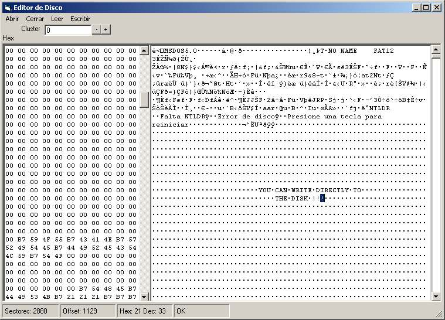

<div align="center">

## IO Directly access to Disk


</div>

### Description

read and write all the bytes of your physical disk.

It´s a beta version, and the interface is very poor.

Only Runs in Nt/W2000/XP.

tell me what you see please.
 
### More Info
 


<span>             |<span>
---                |---
**Submitted On**   |2002-01-11 16:00:02
**By**             |[MaRiØ G\. Serrano](https://github.com/Planet-Source-Code/PSCIndex/blob/master/ByAuthor/mari-g-serrano.md)
**Level**          |Advanced
**User Rating**    |4.9 (44 globes from 9 users)
**Compatibility**  |VB 6\.0
**Category**       |[Complete Applications](https://github.com/Planet-Source-Code/PSCIndex/blob/master/ByCategory/complete-applications__1-27.md)
**World**          |[Visual Basic](https://github.com/Planet-Source-Code/PSCIndex/blob/master/ByWorld/visual-basic.md)
**Archive File**   |[IO\_Directl479351112002\.zip](https://github.com/Planet-Source-Code/mari-g-serrano-io-directly-access-to-disk__1-30693/archive/master.zip)

### API Declarations

```
ReadFile
CloseHandle
CreateFile
WriteFile
SetFilePointer
FlushFileBuffers
FormatMessage
```


